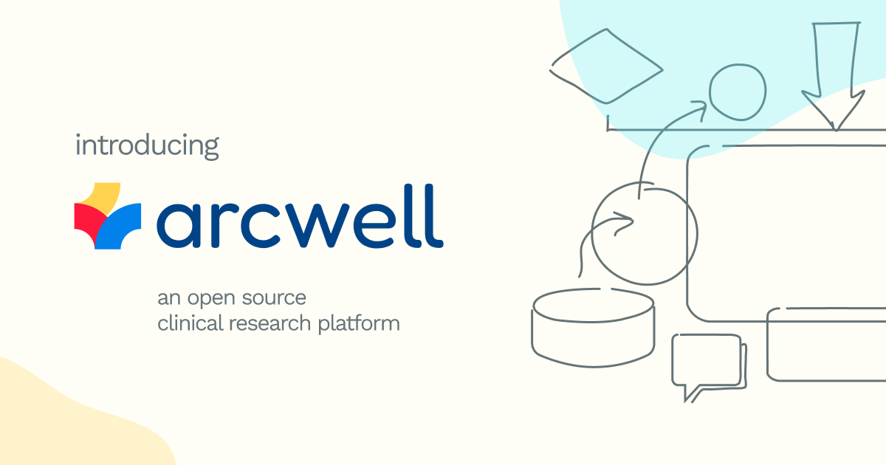

Arcwell Open Source Clinical Research Platform

## Overview

[Arcwell](https://arcwell.health/) is a free, open-source platform designed to
facilitate digital health innovations by streamlining the development of
clinical applications.

The platform is designed to be extensible, allowing non-technical admins to
define custom data types, express their formats for data capture, and model
their intended groupings and representations of people, resources, events,
and factual data. 

The development of this system builds upon over a decade of experience
collected by [Arcweb Technologies](https://arcwebtech.com/) team members in
building digital products focused on healthcare and adjacent industries.

Arcwell lowers the effort required to model digitial solutions to healthcare 
needs including clinical pathways, captured data including patient
observations, and powering the delivery and management of clinical trials,
surveys, assessments, questionnaires, clinical decision support systems, and
more.



## Features

Architecturally, Arcwell is composed of:

- **Arcwell Server** – REST APIs and data models for app integration
- **Arcwell Admin** – An administrative dashboard for management and configuration
- **Example Applications** – Exhibitions of how to integrate with Arcwell

The Arcweb team, as stewards of Arcwell, have outlined a roadmap that will
soon expand this core offering to include:

- **Client Libraries** – SDKs in multiple languages for developers to leverage when integrating Arcwell in their applications
- **Embedded EHR and FHIR Bridge** – FHIR-compliant electronic health record system for caching and synchronizing medical data, local records, and integration with health systems
- **Feature Libraries** – A library of Arcwell types and models that users can easily install in their own instances to implement common conditions and behaviors.
- **Component Libary** – Interface elements written in popular frontend frameworks to facilitate the quick construction of Arcwell-backed application UIs
- **New Features** – Additional features that expand Arcwell's built-in capabilities, including native support for assigned tasks, surveys, server forms, mobile patient navigation tools, and implementation of healthcare standards including eCOA, ePRO, and others

This repository includes the code for _Arcwell Server_ and _Arcwell Admin_, both nested under the `/packages` path, and example uses of Arcwell under 
`/examples`

## Quickstart

### 0. Prerequisites

Arcwell is written primarily in [TypeScript](https://www.typescriptlang.org/). 
To modify and work with the software, it is recommended you install local
software to support development in the JavaScript/TypeScript stack and
supporting plugins in your IDE of choice.

Arcwell is also written with support for Docker containers. Getting a version
up and running within a container is relatively easy once you install
Docker-compatible containerization software. We recommend
[Docker Desktop](https://www.docker.com/products/docker-desktop/)
and have adapted our instructions and guides based on it.

ℹ️ _If you prefer to develop by running services directly on your host machine
(not within containers), 
[this guide outlines your quickstart steps](doc/containerless.md)._ 

Read the instructions below to get up and running quickly using containers.

### 1. Expand local dev environment files

Out-of-the-box, the **Server** and **Admin** applications both require
a `.env.development` file be in place with common configuration. You can
hyrdate an example from `.env.example` in each directory by running a
top-level bootstrap script:

```sh
./scripts/bootstrap.sh
```
☝️ This script convention in Arcweb projects searches sub-packages for their 
own `scripts/bootstrap.sh` and runs each. The scripts are non-destructive and
can be run multiple times in most cases.

You can confirm that the configuration is now set by checking for two env
files with starter config:
* /packages/server/.env.development
* /packages/admin/.env.development

You may wish to tweak some of the settings in the
`packages/server/.env.development` file to meet your needs. We suggest you
consider adjustments to the following variables:

```sh
# Instance Configuration:
ARCWELL_INSTANCE_NAME="Development Arcwell Server"
ARCWELL_INSTANCE_ID=arcweb-dev
```

The `ARCWELL_INSTANCE_NAME` variable is a human-readable name for your server,
which will appear in configuration and the Admin UI. The `ARCWELL-INSTANCE-ID`
variable is a shortstring by which the server is referred.

Once you have configured to your liking, you can double-check that things are
good by confirming the Docker Compose configuration is now working. If this
command displays configuration and exits successfully, you are good to go:

```sh
docker compose config
```

### 2. Start up services in Docker

In local development, a handful of services are orchestrated for you
within Docker and a relationship is configured in the `/compose.yml`
[Compose File](https://docs.docker.com/compose/). These services are:

* **Arcwell Server** as server, defined in `packages/server/Dockerfile`
* **Arcwell Admin** as admin, defined in `packages/admin/Dockerfile`
* **PostgreSQL Database** as db, pulled from [postgres:16-bookworm](https://hub.docker.com/_/postgres/)

Once you've verified that the configuration is in place, you can start the
Docker service containers. The first time through, you'll want to ensure the
new Arcwell containers get built:

```sh
docker compose up --build
```

On subsequent runs, you can just bring them up:

```sh
docker compose up
```

### 3. Run Migrations and Seeds

Prepping your local development database with schema structure and required
seed data is an important step. Run this command from your project root:

```sh
docker compose exec server node ace migration:refresh --seed
```
☝️ Note: The `docker compose exec` invocation is used to run commands against
a running container. This command, for example, is equivalent to running the
command `node ace migration:refresh --seed` within the server container itself.

### 4. Visit Server and Admin in browser

Arcwell Server:
* Confirm the Arcwell Server is up by visiting http://localhost:3333
* Check the healthcheck endpoint at http://localhost:3333/health
* View the local API server docs at http://localhost:3333/docs

Arcwell Admin:
* Browse to the admin root at http://localhost:4200
* Login with seeded dev credentials (see below)

Environment seed data will create a user for you:

| Email                      | Password             | Role    |
|----------------------------|----------------------|---------|
| admin@example.com          | example-healthy-pass | Admin   |

Your environment should now be up and running, ready for you to take a look.


# Explore!

Now, you can poke around the Admin experience or Server code and documentation.


### Object Classes: What are People, Cohorts, Resources, & Events?

Arcwell provides a base data model organized around a few major types:

* **People** – Humans about which your system will store data and track, such as patients, providers, support staff, and other team members
* **Cohorts** – Organize People into logical groups for management purposes
* **Resources** – Any non-humans your system will associate data with or manage, such as medical devices, locations, educational materials, and more
* **Events** – Occurences, instances in time, or time spans you plan to organize data around; examples include the time of a patient report, an encounter, a class, an application session
* **Facts** - The data, measurements, observations, and information you are storing. This is the meat of Arcwell's offering – data can take custom shape, ingested from external services, inserted via the API, or queried using a robust query engine

Each of these major data classes can be typed and customized _by you_ via the Server API
or Arcwell Admin. Moreover, all of the major object classes within Arcwell can accept 
**Tags**, which further allow you to segment and organize your stored data in a custom 
and flexible way. In our work, tags are often used to group data by diagnosis or application.

It is possible to stand up an instance of Arcwell, enter a few type definitions for the
types of people, events, and resources you want to manage, and begin sending data into
that system in minutes.

Consider an example system where Blood Pressure Readings are collected via Medical
Monitor devices from Patients diagnosed with diabetes using a custom application. That
model could be constructed as follows:


You can see this system coordinates:

* **Patients** – a `PersonType` representing patients
* **Medical Monitors** – a `ResourceType` describing configuration for monitors
* **App Sessions** – an `EventType` for earmarking sources from which data flows into the system
* **Blood Pressure Readings** - a `FactType` to define the schema and parameters of reading information produced by the monitors
* **"diagnosis/diabetes"** - a `Tag` to make patients and their associated BP readings easily searchable by data queries

How you organize your own data system is completely up to you.

### Data System: What are Facts?

**Facts**

### Data Model: How Types Work

* Each of the major objects (Facts, People, Resources & Events) have a type.  
* The purpose of the types is to group and define the schema definition of the dimensions

Below is an example schema for the blood pressure fact type that is located in the object's `dimensionSchemas` jsonb field
```json
[
  { "name": "Diastolic Pressure", "key": "diastolic", "dataType": "number", "isRequired": true },
  { "name": "Systolic Pressure", "key": "systolic", "dataType": "number", "isRequired": true },
  { "name": "Heart Rate", "key": "heart_rate", "dataType": "number", "dataUnit": "beat/min", "isRequired": false }
]
```
* `name` - is for display purposes
* `key` - should be a unique name within each object and is used for querying (see below)
* `dataType` - defines the data type and will be used to validate during creation of new objects.  Currently `string` and `number` are supported, but `date` and `boolean` will be added soon
* `dataUnit` <OPTIONAL> is just for display
* `isRequired` <OPTIONAL> <DEFAULT=true> - if true, the field will be required to create/update dimensions on the child object
* A data schema is not required for types, but the child objects of that type will not be able to add any dimensions.

### Data API: Inserting and Querying Data

#### Inserting
* When adding dimensions to an object, you must supply all "isRequired" fields
Example Insert:
 
`POST /api/v1/data/insert`
```json
{
    "observedAt": "2025-11-15T23:11:00.000-05:00",
    "typeKey": "blood_pressure",
    "personId": "522291d6-2c91-4801-aacf-ac0759f7b175",
    "dimensions": [
        {
            "key": "diastolic",
            "value": 85
        },
        {
            "key": "systolic",
            "value": 135
        }
    ]
}
```


#### Querying

* The dimensions can be queried with the api/v1/data/query endpoint
* The query parameter format is `dim[key][operator]=value` or `filter[field_name]=value`


* *Example: return all facts with a heart_rate greater than 80


```
/api/v1/data/query?dim[heart_rate][gt]=80
```


* Filter can be used to query any object on the base object.  Filters always assume "equals"* 


* Example: return all facts with person_id equal to 4073aecb-6c8a-4161-b15c-270f44367f72


```
/api/v1/data/query?filter[person_id]=4073aecb-6c8a-4161-b15c-270f44367f72
```

* You can combine and chain multiple filters and dim tags

* Example: return all facts with person_id equal to 4073aecb-6c8a-4161-b15c-270f44367f72 AND heart_rate > 80 AND provider equal to "Dr. Simon Reed"

```
/api/v1/data/query?dim[provider][eq]=Dr. Simon Reed&dim[heart_rate][gt]=80&filter[person_id]=4073aecb-6c8a-4161-b15c-270f44367f72
```


* The valid sql operators are:
  * eq = equals
  * gt = greater than
  * gte = greater than or equal
  * lt = less than
  * lte = less than or equal
  * ne = not equal


We have provided a Postman definition for use with the 
[Postman API Platform](https://www.postman.com/)
and compatible services. This can be useful for development to learn the
API contracts, formats, and endpoints:

- Use the included [Postman Environment](<doc/Arcwell Lib.postman_environment.json>) to setup your localhost-pointed Postman environment
- Pull the full [Postman API definition](doc/Arcwell.postman_collection.json) to experiment with the Server REST API locally


## Deployment & Hosting

Arcwell's architecture makes hosting possible via a variety of approaches.

While it is possible to host on a single machine, containerized, or "on
metal," we have provided an example Terraform definition which you can use as
a starting point to adapt your own robust cloud-hosted setup in AWS,
leveraging RDS databases, ECS containers, and common networking security 
boundaries.

[Review the example Terraform environment](examples/infrastructure-terraform-aws)

We will provide more detailed documentation and guidance on complex hosting 
situations soon.


## More to Know

Learn more about Arcwell and where we're going with it at 
https://arcwell.health 

The latest news and information about Arcwell is often available on
[our Linktree](https://linktr.ee/ArcwebTech)

**How much does Arcwell cost?**
>Arcwell is completely free and built under the Apache 2.0 license, which means you can use, modify, and distribute the software freely, even in commercial applications.

**Who is Arcwell for?**
> Arcwell is for researchers, healthcare providers, digital health startups, and anyone looking to build or enhance clinical applications.

**Who is responsible for Arcwell?**
> Arcwell is developed by Arcweb Technologies, a digital product development company dedicated to advancing healthcare through technology.

**Why is it free?**
> Arcweb Technologies is on a mission to democratize health and
> wellness. That’s why we’ve built Arcwell to reduce barriers to 
> healthcare innovation, such as high development costs, complex 
> technical requirements, strict security compliance, and lengthy 
> timeframes for deployment. Some future modules may require paid 
> subscriptions.

**Can I use this in a product I hope to commercialize?**
> Absolutely! You can utilize Arcwell in commercial products, provided 
> you adhere to the licensing terms.

**What license is Arcwell distributed under?**
> Arcwell is distributed under the Apache 2.0 license, allowing you to
> freely use, modify, and distribute the software, even in commercial 
> applications, as long as you comply with the license terms. All 
> packages and dependencies used in Arcwell are open source. Check out 
> our Software Bill of Materials for more detailed information.

**Can I contribute to Arcwell?**
> We welcome community involvement through custom code, documentation, 
> and feature suggestions, but community-developed features cannot be 
> incorporated into the codebase just yet, as we are working on a 
> streamlined review process to ensure quality standards are maintained.


## Arcwell Team

Arcwell was built with ❤️ in and around the Philadelphia region by 
members of the Arcweb Technologies team.

<a href="https://github.com/timgetz"></a>
<a href="https://github.com/mccolin"></a>
<a href="https://github.com/mberlin-arcweb"></a>
<a href="https://github.com/tmolumby"></a>
<a href="https://github.com/gregvuzit"></a>
<a href="https://github.com/alex-smith-arcweb"></a>
<a href="https://github.com/hswope-arcweb"></a>
<a href="https://github.com/maudiakent"></a>
<a href="https://github.com/lendamico"></a>
<a href="https://github.com/cera"></a>

---

Licensed under the [Apache 2.0 License](./LICENSE)  
Copyright 2024 [Arcweb Technologies](https://arcwebtech.com)


