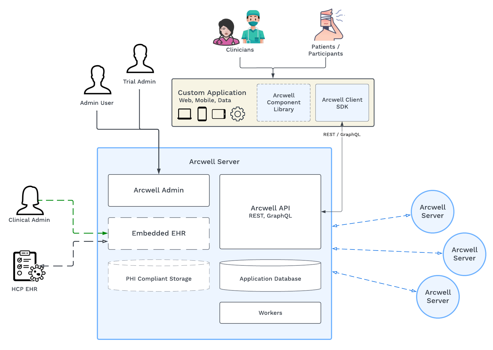

Arcwell Digital Medicine Platform

## Architecture Overview
Arcwell is built in a model following a Client-Server approach where:

* The **Arcwell Server** is an instance that contains business logic, data modeling, and interoperability configuration with other systems

* Clients are built as custom applications leveraging an **Arcwell Client SDK** –  libraries which facilitate connecting to and interacting with Arcwell Servers. UI applications can choose to leverage components from an **Arcwell Component Library**.

* The server provides **Arcwell Admin**, the interface for configuration, data visualization, and access to data and setup.

This means that a representative end-user application or an **"Arcwell Application"** will be a separate entity that leverages the Client libraries to connect to Arcwell.

